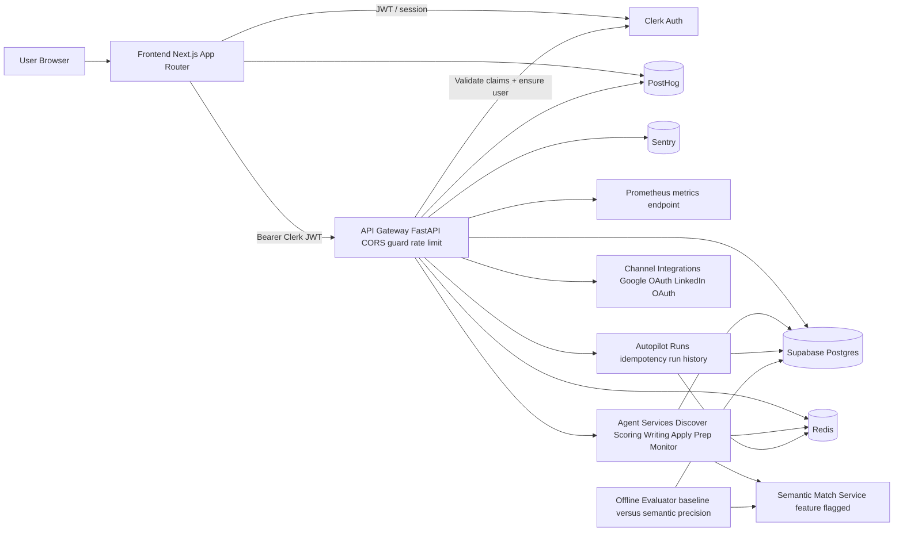
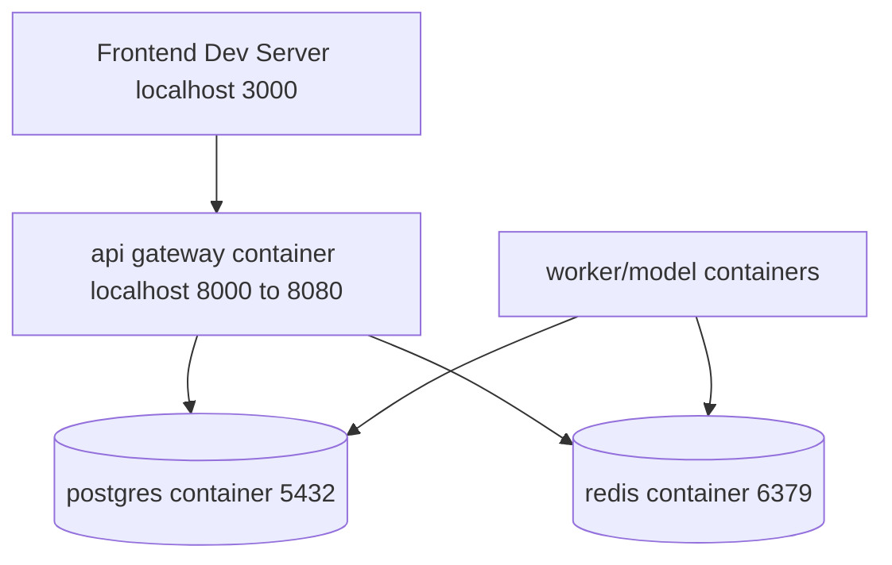

# Doubow

> Multi-agent job search platform where AI drafts and humans approve.

<p align="left">
  
</p>

## ✨ Overview

Doubow combines a modern Next.js frontend with a FastAPI backend to help users discover roles, score fit, prepare applications, and safely approve outbound actions.

- 🧭 Discover scored jobs
- 🗂️ Track applications in pipeline
- ✅ Approve/reject drafts with HITL safety
- 🎯 Generate interview prep
- 📄 Parse resume into structured profile
- 🤖 Monitor all agent activity

## 🏗️ High-Level Architecture



**Request path (typical):**
- User interacts with dashboard routes in `frontend/`.
- Frontend sends authenticated requests to `backend/api_gateway`.
- FastAPI validates Clerk identity, applies localhost-safe CORS policy, scopes every read/write to `user_id`, and orchestrates domain services.
- Services persist state in Postgres, use Redis for transient/queue-friendly workflows, and emit telemetry to PostHog.
- Semantic matching is feature-flagged and blended into scoring when enabled; offline evaluator scripts compare baseline vs semantic precision.
- Approval handoff is channel-aware (email + LinkedIn) with explicit user approval before outbound actions.
- Autopilot supports idempotent execution and run-history retrieval for operations visibility.
- API exposes `/metrics` for Prometheus scraping and Sentry hooks for error observability.

### Deployment View (Local)



## 🧱 Frontend + Backend Stack

### Frontend (`frontend/`)
- Next.js 14 App Router + TypeScript
- SWR data fetching + Zustand state
- Clerk auth UI integration
- PostHog client telemetry
- Icons via `lucide-react`
- Motion support via `framer-motion`

### Backend (`backend/`)
- FastAPI API gateway
- SQLAlchemy + Alembic migrations
- Postgres + Redis-friendly architecture
- Agent/service modules for discovery, scoring, writing, apply, prep, monitor
- PostHog-backed activation KPI endpoint

## 🗺️ Repo Map

- `frontend/` — web application
- `backend/` — API, models, migrations, scripts, workers
- `docs/` — architecture, design system, onboarding, product maps
- `backend/infra/` — Docker snippets (Postgres/Redis dev stack, optional API/worker/nginx samples)

Primary references:
- `docs/structure.md`
- `docs/product-panels.md`
- `docs/architecture/doubow-high-level-flow.md`
- `docs/architecture/daubo-architecture-claude.md`
- `docs/architecture/daubo-design-system.md`

## 🎨 Design, Icons, Animation

- Main logo: Doubow mark (see `frontend/public/favicon.svg` and `frontend/components/Logo.tsx`).
- Icon language: `lucide-react` for consistent UI semantics across dashboard and landing.
- Product visual system is documented in `docs/design.md` and `docs/architecture/daubo-design-system.md`.
- Core motion primitives: fade/slide progress transitions, loading indicators, and low-amplitude hover elevation.
- Animation library: `framer-motion` (landing and interaction micro-motion).

Visual references you can embed in GitHub markdown:
- `docs/design-screens/target-daubo.png`
- `docs/design-screens/landing-daubo-full-redesign.png`
- `docs/design-screens/local-daubo-after-pixel-pass.png`
- `frontend/public/reference/landing/hero-dashboard-real.png`

Animation guidance:
- Add short `.gif` demos in `docs/design-screens/` (Discover loading, Approvals flow, Dashboard interactions).
- Link them in this README under a “Demo” section when available.

## 🚀 Quick Start

### 1) Setup environment

```bash
cp .env.example .env
cp backend/.env.example backend/.env
```

### 2) Install dependencies

```bash
npm install
```

### 3) Start frontend

```bash
npm --prefix frontend run dev
```

### 4) Start backend stack

```bash
docker compose -f backend/docker-compose.yml --env-file backend/.env up --build
```

Stop backend stack:

```bash
docker compose -f backend/docker-compose.yml --env-file backend/.env down
```

## 🧪 Local Validation

- Frontend: `http://localhost:3000`
- Auth route: `http://localhost:3000/auth/sign-up`
- API health: `http://localhost:8000/healthz`
- Week 1 KPI snapshot: `./.venv-test/bin/python scripts/baseline_report.py`
- Phase 3 offline semantic precision eval:
  `./.venv-test/bin/python scripts/semantic_precision_eval.py --user-id <clerk_user_id>`
- Phase 3 with stronger outcome-proxy labels:
  `./.venv-test/bin/python scripts/semantic_precision_eval.py --user-id <clerk_user_id> --label-mode outcome`

## 🗄️ Database Workflow (Supabase/Postgres)

Set `DATABASE_URL`, then run:

```bash
make -C backend db-sync
```

Explicit steps:

```bash
make -C backend db-migrate
make -C backend db-seed
make -C backend db-verify
```

Reset demo fixtures only:

```bash
make -C backend db-reset-demo
```

## 📈 Telemetry And KPI (PostHog)

Frontend env:
- `NEXT_PUBLIC_POSTHOG_KEY`
- `NEXT_PUBLIC_POSTHOG_HOST`

Backend env:
- `POSTHOG_HOST`
- `POSTHOG_PROJECT_ID`
- `POSTHOG_PROJECT_API_KEY`
- `POSTHOG_PERSONAL_API_KEY`

Behavior:
- Frontend captures product events/pageviews.
- Backend mirrors activation events and serves `activation-kpi` (avg/latest/sample size).

## 🛣️ Product Surfaces

- `/discover` — scored job discovery + onboarding states
- `/pipeline` — application tracking + integrity checks
- `/approvals` — human approval gate for outbound actions
- `/prep` — role-specific interview preparation
- `/resume` — resume upload, parse, preferences
- `/agents` — multi-agent status + orchestration context

## 📚 Documentation

- Architecture: `docs/architecture/`
- Design system: `docs/architecture/daubo-design-system.md`
- Product panel behavior: `docs/product-panels.md`
- Onboarding notes: `docs/onboarding.md`
- Stack decision matrix and baseline gates: `docs/stack-decisions.md`
