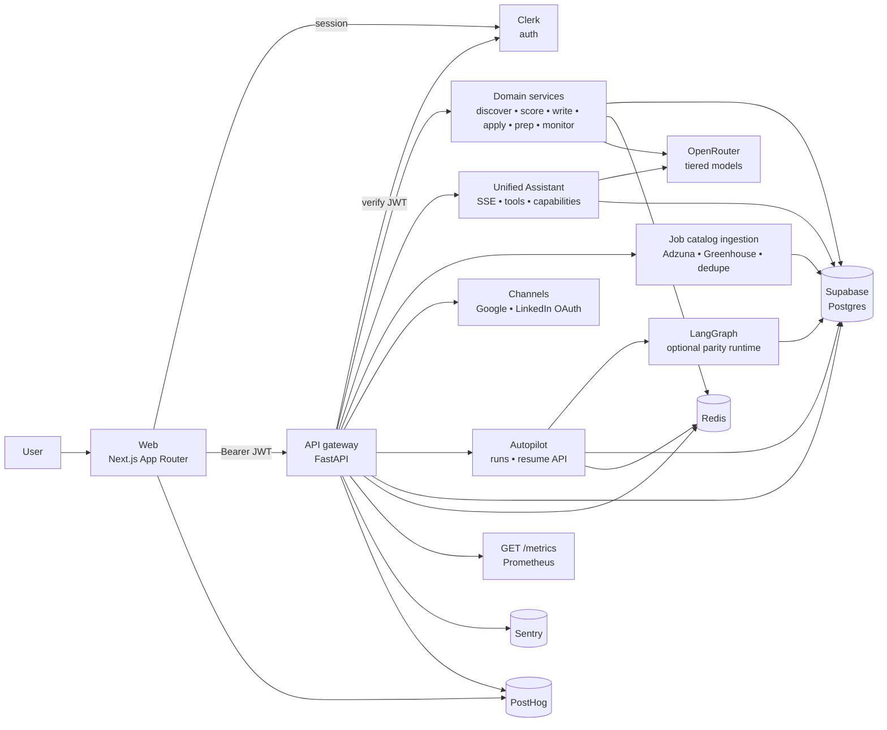
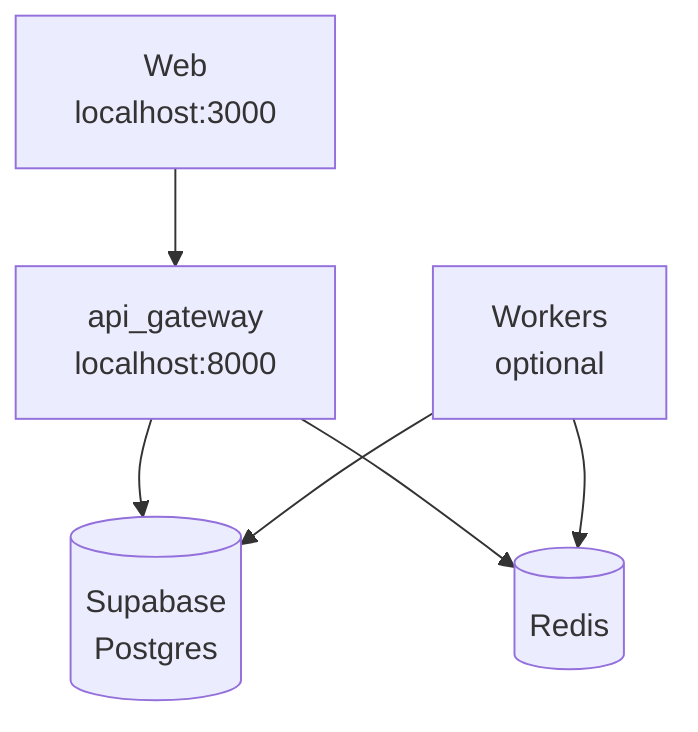

# Doubow

> Multi-agent job search platform where AI drafts and humans approve.

<p align="left">
  
</p>

## ✨ Overview

Doubow combines a modern Next.js web app with a FastAPI backend to help users discover roles, score fit, prepare applications, and safely approve outbound actions.

- 🧭 Discover scored jobs
- 🗂️ Track applications in pipeline
- ✅ Approve/reject drafts with HITL safety
- 🎯 Generate interview prep
- 📄 Parse resume into structured profile
- 💬 **Unified Assistant** (Messages) — chat + **slash commands** and **structured tools** with the same outcomes as Discover, Pipeline, and Approvals (`/v1/agents/chat`, `/v1/agents/capabilities`)
- 🌐 **Job catalog ingestion** — Adzuna + Greenhouse (preset + scheduled runners) into a shared job catalog
- 🤖 Monitor background agent status; optional **LangGraph** autopilot when enabled

## 🏗️ High-Level Architecture

The runtime diagram below matches **`docs/architecture/doubow-high-level-flow.md`** line-for-line; that doc adds Assistant/ingestion detail, **Boundaries**, observability tables, and local deployment prose. **LLM** is reached via domain services and the Assistant, not as `API → LLM`. Semantic match and offline eval are scoring-layer concerns—see **At a glance** and **Local Validation**.



**At a glance**

- **Auth & API** — Dashboard in `apps/web/` calls `backend/api_gateway` with Clerk JWT; requests are scoped by `user_id` with CORS tuned for local dev.
- **Assistant** — `/messages`: `POST /v1/agents/chat` (SSE), optional `ORCHESTRATOR_LLM_TOOL_ROUTING`, `GET /v1/agents/capabilities`; assistant counters on **`GET /metrics`**.
- **Data & LLM** — Supabase Postgres is durable; Redis for coordination/caches; OpenRouter tiered models for chat, drafts, prep, resume parsing, optional tool planner.
- **Ingestion** — Adzuna + Greenhouse → shared **`jobs`** (dedupe, audit tables); scripts under `backend/scripts/`.
- **Scoring extras** — Semantic match when feature-flagged; offline eval scripts vs baseline (see **Local Validation** below).
- **Outbound** — Approvals are channel-aware (email, LinkedIn); user approval before send.
- **Autopilot** — Background runs; optional LangGraph + checkpoints + resume API; **`backend/README.md`** for flags.
- **Observability** — PostHog (product), Sentry (errors), Prometheus **`/metrics`**; optional **LangChain** for structured resume parsing (`USE_LANGCHAIN` in `.env.example`).

### Deployment View (Local)



Matches the local section in **`docs/architecture/doubow-high-level-flow.md`** (no OpenRouter box—traffic is HTTPS from the API/workers). Assistant, ingestion, and autopilot usually share the **same API process** in dev unless workers are split. Autopilot and LangGraph flags: **`backend/README.md`**.

## 🧱 Frontend + Backend Stack

### Web App (`apps/web/`)
- Next.js 14 App Router + TypeScript
- SWR data fetching + Zustand state
- Clerk auth UI integration
- PostHog client telemetry
- Icons via `lucide-react`
- Motion support via `framer-motion`

### Backend (`backend/`)
- FastAPI API gateway
- SQLAlchemy + Alembic migrations
- Postgres + Redis-friendly architecture
- Agent/service modules for discovery, scoring, writing, apply, prep, monitor
- **Unified Assistant**: orchestrator chat, tool executor parity with UI, optional LLM tool router
- **Job providers**: Adzuna + Greenhouse adapters, preset ingestion, `backend/scripts/*_ingestion_runner.py`
- Optional **LangGraph** autopilot runner (feature flags): parity graph nodes, **`graph_checkpoint`** on `autopilot_runs`, resume API for stuck runs
- Optional **LangChain** (`langchain-core`) for structured resume analysis when `USE_LANGCHAIN` is on
- PostHog-backed activation KPI endpoint

## 🗺️ Repo Map

- `apps/web/` — web application
- `backend/` — API, models, migrations, scripts, workers
- `docs/` — architecture, design system, onboarding, product maps
- `backend/infra/` — Docker snippets (Postgres/Redis dev stack, optional API/worker/nginx samples)

Primary references:
- `docs/structure.md`
- `docs/product-panels.md`
- `docs/architecture/doubow-high-level-flow.md`
- `docs/architecture/daubo-architecture-claude.md`
- `docs/architecture/daubo-design-system.md`

## 🎨 Design, Icons, Animation

- Main logo: Doubow mark (see `apps/web/public/favicon.svg` and `apps/web/components/Logo.tsx`).
- Icon language: `lucide-react` for consistent UI semantics across dashboard and landing.
- Product visual system is documented in `docs/design.md` and `docs/architecture/daubo-design-system.md`.
- Core motion primitives: fade/slide progress transitions, loading indicators, and low-amplitude hover elevation.
- Animation library: `framer-motion` (landing and interaction micro-motion).

Visual references you can embed in GitHub markdown:
- `docs/design-screens/target-daubo.png`
- `docs/design-screens/landing-daubo-full-redesign.png`
- `docs/design-screens/local-daubo-after-pixel-pass.png`
- `apps/web/public/reference/landing/hero-dashboard-real.png`

Animation guidance:
- Add short `.gif` demos in `docs/design-screens/` (Discover loading, Approvals flow, Dashboard interactions).
- Link them in this README under a “Demo” section when available.

## 🚀 Quick Start

### 1) Setup environment

```bash
cp .env.example .env
cp backend/.env.example backend/.env
```

### 2) Install dependencies

```bash
npm install
```

### 3) Start web app

```bash
npm run dev:web
```

### 4) Start backend stack

```bash
docker compose -f backend/docker-compose.yml --env-file backend/.env up --build
```

Stop backend stack:

```bash
docker compose -f backend/docker-compose.yml --env-file backend/.env down
```

## 🧪 Local Validation

- Frontend: `http://localhost:3000`
- Auth route: `http://localhost:3000/auth/sign-up`
- API health: `http://localhost:8000/healthz` (liveness), `http://localhost:8000/ready` (readiness — Postgres + Redis status)
- Week 1 KPI snapshot: `./.venv-test/bin/python scripts/baseline_report.py`
- Phase 3 offline semantic precision eval:
  `./.venv-test/bin/python scripts/semantic_precision_eval.py --user-id <clerk_user_id>`
- Phase 3 with stronger outcome-proxy labels:
  `./.venv-test/bin/python scripts/semantic_precision_eval.py --user-id <clerk_user_id> --label-mode outcome`

## 🗄️ Database Workflow (Supabase/Postgres)

Set `DATABASE_URL`, then run:

```bash
make -C backend db-sync
```

Explicit steps:

```bash
make -C backend db-migrate
make -C backend db-seed
make -C backend db-verify
```

Reset demo fixtures only:

```bash
make -C backend db-reset-demo
```

## 📈 Telemetry And KPI (PostHog)

Frontend env:
- `NEXT_PUBLIC_POSTHOG_KEY`
- `NEXT_PUBLIC_POSTHOG_HOST`

Backend env:
- `POSTHOG_HOST`
- `POSTHOG_PROJECT_ID`
- `POSTHOG_PROJECT_API_KEY`
- `POSTHOG_PERSONAL_API_KEY`

Behavior:
- Frontend captures product events/pageviews.
- Backend mirrors product events and serves:
  - `GET /v1/me/telemetry/activation-kpi` (avg/latest/sample size for resume -> first matches),
  - `GET /v1/me/telemetry/outcome-kpi` (approval resolution/acceptance/send conversion rates),
  - `GET /v1/me/telemetry/launch-scorecard` (single GO/WATCH/NO_GO snapshot combining activation, outcomes, and stability signals).

## 🛣️ Product Surfaces

- `/discover` — scored job discovery + onboarding states
- `/pipeline` — application tracking + integrity checks
- `/approvals` — human approval gate for outbound actions
- `/prep` — role-specific interview preparation
- `/resume` — resume upload, parse, preferences
- `/messages` — **Unified Assistant** (streaming chat, slash commands, structured account actions; capabilities from API)
- `/agents` — redirects to `/messages` (bookmark compatibility)
- `/billing` — subscription & billing (layout from `docs/mockup/subscription_billing`)

## 📚 Documentation

- Capstone rubric + readiness (eval notes, deployment checklist, demo script, risk register): `docs/capstone-scoring-sheet.md`, `docs/capstone-readiness.md`
- Architecture: high-level flow `docs/architecture/doubow-high-level-flow.md`; resilience (health probes, rate limits, OpenRouter circuit): `docs/architecture/resilience.md`
- Backend detail (LLM tiers, ingestion, autopilot/LangGraph): `backend/README.md`
- Design system: `docs/architecture/daubo-design-system.md`
- Product panel behavior: `docs/product-panels.md`
- Onboarding notes: `docs/onboarding.md`
- Stack decision matrix and baseline gates: `docs/stack-decisions.md`
