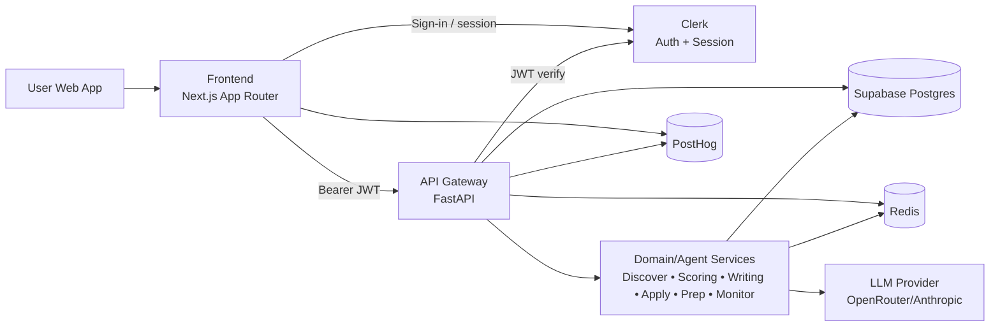
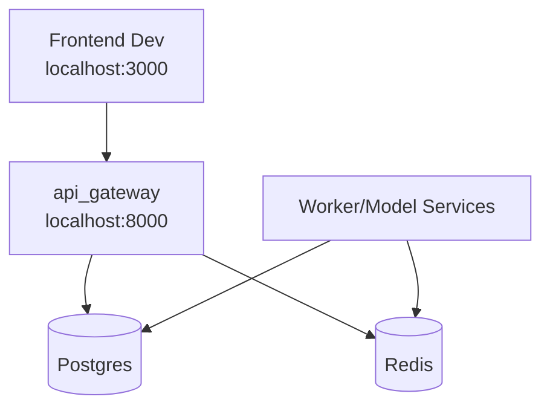

# Doubow High-Level Flow

This diagram is the capstone-facing architecture view for the current implementation.
It reflects what is actually running in the repository today.

## Why LangGraph Is Not Shown

LangGraph is not included in this architecture because it is not currently implemented in this codebase.

- Current orchestration is service/router driven inside the FastAPI application.
- There are no `langgraph` dependencies or graph runtime modules in the repository.
- If you introduce LangGraph later, it would sit between `API Gateway` and `Domain/Agent Services` as a dedicated agent workflow runtime.

## Multi-step workflows without a graph runtime

The product flow **discover → score → draft → approve → send/prep** is represented as **explicit domain services plus durable state**, not a separate workflow engine:

- **Discover / score**: jobs and `job_scores` rows in Postgres; applications move to the **score** pipeline stage until a score exists for that user + job.
- **Draft / approve**: `approvals` rows hold draft text and human gate states (`pending` → `approved` / `edited`); branching (reject / discard) is normal application logic.
- **Send / prep**: approval timestamps and application status feed the **send_prep** stage; queues or workers can drive outbound actions without a graph DB.

Each `Application` returned by the API includes a derived **`pipeline_stage`** field (`score` | `draft` | `approve` | `send_prep`) computed from those tables—see `backend/api_gateway/workflow/pipeline.py`.

**Retries** for unstable outbound calls (e.g. OpenRouter HTTP) use bounded exponential backoff in `backend/api_gateway/workflow/retry.py`, wired through `services/openrouter.py`.

**Durable state** for runs and user-scoped entities remains **Postgres** (and **Redis** for caches/sessions/worker coordination where configured)—no additional workflow database is required for the current scope.

## Local Deployment View

