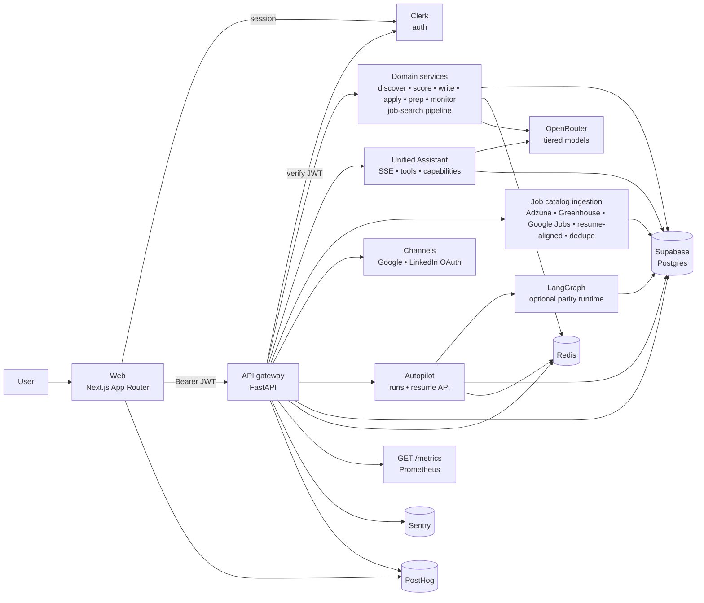
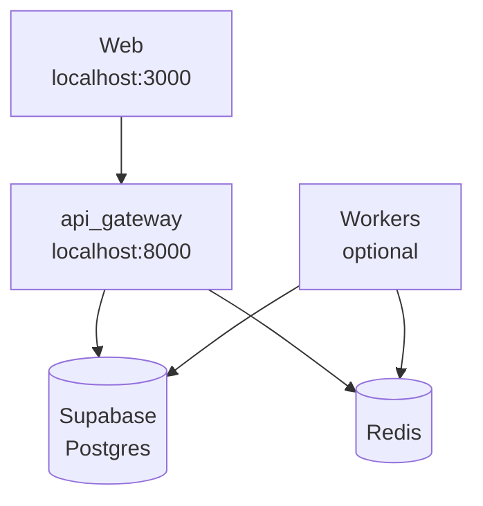

# Doubow — high-level architecture

Capstone-facing view of what runs in this repo today. For stack commands and env, see the root **`README.md`** and **`backend/README.md`**.

## Runtime diagram

**Boundaries:** The browser talks only to Clerk and the API. **Supabase Postgres** is the durable source of truth; **Redis** backs caches and coordination. **LLM** calls go through OpenRouter from domain services and the Assistant, not as a separate network hop from the diagram’s perspective.

**Job-search pipeline** (`JobSearchPipelineCoordinator`) runs inside the API as domain logic: multi-stage **data collection → resume profile → job matching (rescore) → outbound snapshot → feedback**. It can persist **`feedback_learning`** (outcome snapshot + **`matching_blend_hints`**) into résumé preferences; **`jobs_service`** may apply those hints when recomputing **`job_scores`**. Invoked via **`POST /v1/agents/job-search-pipeline/run`** and assistant tool **`run_job_search_pipeline`** (same parity pattern as other agent actions).

---

## Unified Assistant

Primary UI: **`/messages`** (`/agents` redirects). **`POST /v1/agents/chat`** streams SSE; intent becomes **structured actions** that call the same services as REST.

| Concern | Implementation |
|--------|----------------|
| Fast path | Slash / keyword routing (`services/agent_action_executor.py`) |
| Optional planner | `ORCHESTRATOR_LLM_TOOL_ROUTING` → JSON tool choice (`services/agent_tool_router.py`) |
| Discovery | `GET /v1/agents/capabilities` (`services/agent_tools_catalog.py`) |
| Metrics | `doubow_assistant_tool_routing_total`, `doubow_assistant_action_total` on **`GET /metrics`** |
| Pipeline runner | Same HTTP behavior as product: **`run_job_search_pipeline`** → `JobSearchPipelineCoordinator` |

---

## Job catalog ingestion

Providers (**Adzuna**, **Greenhouse**, **Google Jobs** via SerpAPI when configured) upsert into shared **`jobs`** with dedupe and audit (`job_source_records`, `job_ingestion_runs`). **Resume-aligned** pulls use `resume_catalog_params` / `catalog_ingest_orchestrator` so keywords and location follow the user’s latest résumé and preferences; optional **legacy connectors** can be enabled on ingest.

Orchestration: `services/job_provider_ingestion_service.py`, **`catalog_ingest_orchestrator`** for preset runs; CLI runners under **`backend/scripts/`**. Env and curls: **`backend/README.md`**.

---

## Job search pipeline & outcome learning

| Piece | Role |
|-------|------|
| Coordinator | `services/job_search_pipeline.py` — stages `data_collection`, `resume_profile`, `job_matching`, `outbound_application`, `feedback` |
| Feedback snapshot | `services/job_search_feedback.py` — rates, insights, **`matching_blend_hints`** (advisory deltas) |
| Scoring | `services/jobs_service.py` — global semantic / lexical / LLM weights ± stored hints; metric **`doubow_matching_blend_score_sync_total`** |
| Preferences | `resume.preferences.feedback_learning` (optional persist from pipeline `persist_feedback_learning`) |
| Preferences API | **`GET` / `DELETE` `/v1/me/preferences/feedback-learning`** — read/clear outcome-based match tuning (requires a résumé); used by the product UI |

Figures (PNG for embedding): **`docs/architecture/job-search-pipeline/pipeline-stages.png`**, **`scoring-and-feedback-loop.png`** (sources: `*.svg`).

---

## Product pipeline and autopilot

End-to-end flow is **domain services + Supabase Postgres state**, not a separate workflow database:

- **Discover → score → draft → approve → send/prep** — `job_scores`, `approvals`, application status; API exposes derived **`pipeline_stage`** (`backend/api_gateway/workflow/pipeline.py`).
- **Retries** — bounded backoff for unstable HTTP (`backend/api_gateway/workflow/retry.py`, used from OpenRouter client code paths).

**Autopilot** adds background runs with idempotency and history. Optional **LangGraph** (`USE_LANGGRAPH_AUTOPILOT`) runs a parity graph inside the API/worker process; **`USE_LANGGRAPH_AUTOPILOT_CHECKPOINT`** persists checkpoints to Supabase Postgres; **`POST /v1/me/autopilot/runs/{run_id}/resume`** recovers stuck runs. On graph failure, execution can fall back to the legacy executor.

---

## Observability (why three tools)

| Tool | Role |
|------|------|
| **PostHog** | Product telemetry and (when configured) activation KPI sourcing |
| **Sentry** | Exception grouping, alerts, optional tracing (`SENTRY_DSN`) |
| **Prometheus** | `GET /metrics` — HTTP, LLM usage, assistant routing/actions, **`doubow_matching_blend_score_sync_total`** (feedback snapshot × personalized blend during score sync) |

---

## Local deployment

Assistant, ingestion, and autopilot normally share the **same API process** in local dev unless you split workers (e.g. Celery). OpenRouter is reached over HTTPS from the API/workers.
